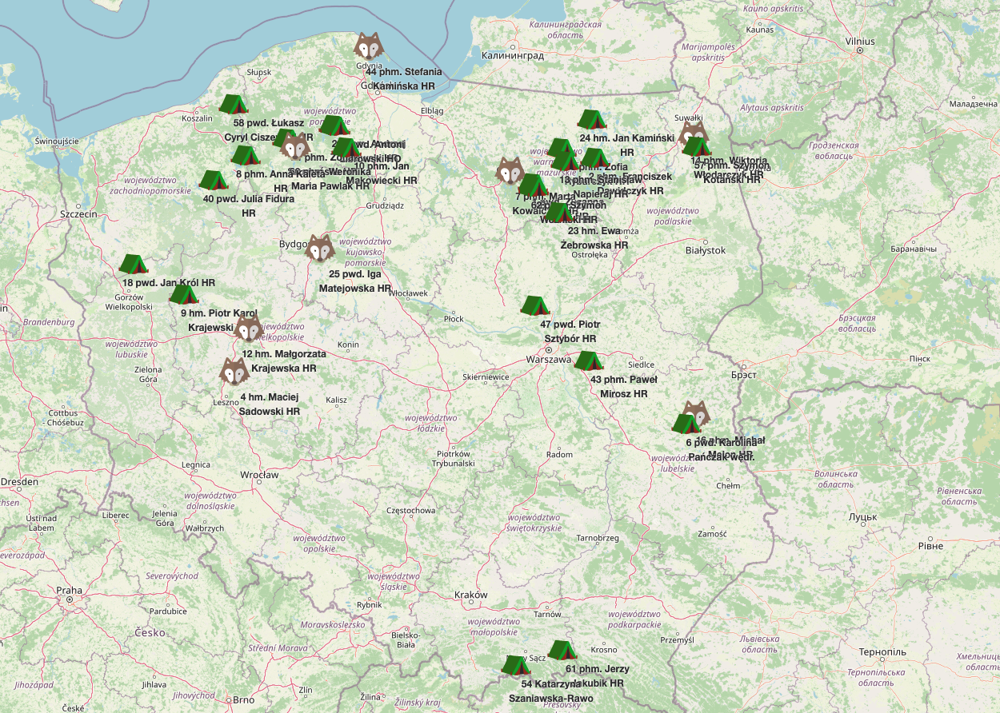

# Scout Camps Map

Interactive map visualization for Polish Scout Association (ZHR) camps. This tool generates an interactive Leaflet.js map from TSV camp data, showing camp locations with details like commanders, dates, and participating scout troops.



## Features

- 🗺️ Interactive map with camp markers
- 🏕️ Different icons for camp types (permanent camps vs colonies)
- 📍 Automatic GPS coordinate parsing (multiple formats supported)
- 👤 Commander information with ranks displayed
- 📅 Camp dates and participating troops
- ⚠️ Warnings for camps that couldn't be mapped

## Quick Start

1. **Install dependencies:**
   ```bash
   npm install
   ```

2. **Prepare your data:**
   - Place your TSV file as `data/HAL.tsv`
   - The TSV should include columns for:
     - Camp number, commander info, GPS coordinates
     - Camp type, dates, and participating troops
     - See the included example for format

3. **Generate the map:**
   ```bash
   npm run generate
   ```

4. **View the map:**
   - Open `public/index.html` in your browser
   - The map will show all camps with valid GPS coordinates

## Data Format

The script expects a TSV file with these key columns (Polish names):
- `Nr` - Camp number
- `Odwołany?` - Cancelled status (TRUE/FALSE)
- `Współrzędne GPS` - GPS coordinates
- `Forma wyjazdu (znormalizowana)` - Camp type
- `Imię/Nazwisko komendanta/komendantki` - Commander name
- `Stopień instruktorski/harcerski` - Ranks
- `Data rozpoczęcia/zakończenia` - Start/end dates
- `Nazwa drużyny 1-8` - Troop names

### Supported GPS Formats
- Decimal: `52.123456, 21.987654`
- With location: `52.123456, 21.987654, Location Name`
- DMS with spaces: `52.345678 N, 21.876543 E`
- DMS traditional: `52°12'34.5"N 21°45'32.1"E`
- European decimal: `52,123456, 21,987654`

## Customization

### Change displayed information
Edit the camp details in `scripts/generate-camps-json.js`:
- Modify the `detailsHtml` section to add/remove fields
- Update the `name` format for camp titles

### Add new camp types
Add icon definitions in the `icons` object in the generated HTML

## Dependencies
- [Leaflet.js](https://leafletjs.com/) (CDN in HTML)
- [PapaParse](https://www.papaparse.com/) (for TSV parsing)

## License Attribution

### Icons
- **tent.svg** - Apache License 2.0 ([Source](https://www.svgrepo.com/svg/398471/tent))
- **wolf.svg** - Public Domain ([Source](https://www.svgrepo.com/svg/484935/wolf)) 